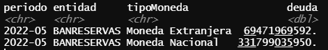

# supeRbancos

## Resumen
supeRbancos es una paquete de R para consultar de manera fácil los datos del del sector bancario dominicano de que ofrece la Superintendencia de Bancos (SB) a través de su API. Permite acceder a informaciones como los estados de resultados, estados de situación y cartera de créditos en formato "data frame" rápidamente.

## Instalación
```r
devtools::install_github('Lien3105/supeRbancos')
```

## Autenticación
Primero, crea una cuenta de desarrollador de la SB para acceder a su API [aquí](https://desarrollador.sb.gob.do/). A continuación deberás elegir el "Plan analista" y obtendrás tu "Primary Key". Para utilizar el paquete deberás indicar el Key para realizar cada consulta con `sb_get()`.

```r
api_key <- 'xxxxxxxxxxxxxxxxxxxxx'

data <- sb_get(api_key,...)
```

## Cómo usarlo
### ¿Cómo era la cartera de créditos por moneda de Banreservas en mayo de 2022?
```r
library(supeRbancos)
cc_banreservas <- sb_get(api_key, end_point = 'carteras/creditos/moneda',
                         periodo_inicial = "2022-05", periodo_final = "2022-05",
                         entidad = "BANRESERVAS")
```

